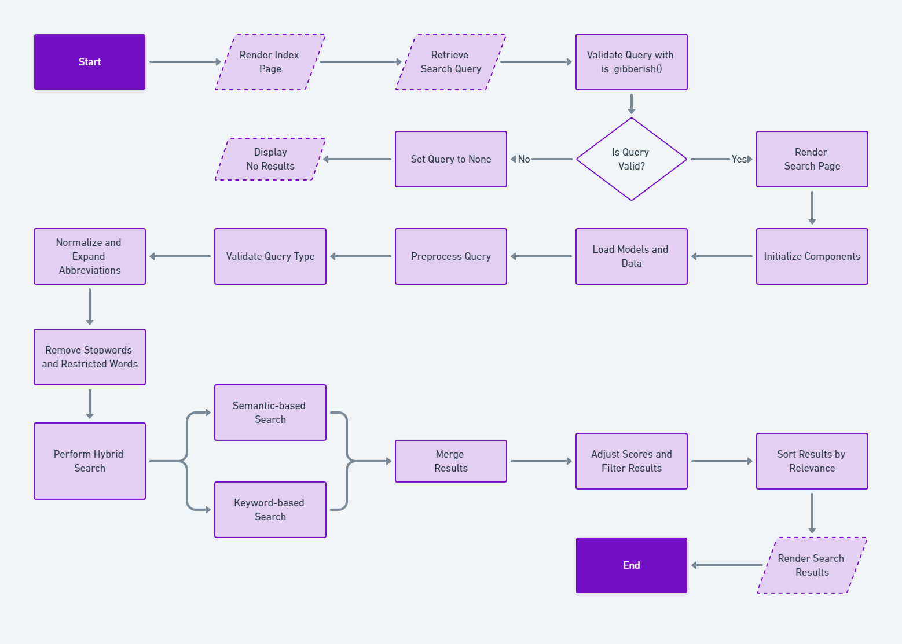

# Hack-Babies

Welcome to the **Hack Babies** project! This repository provides a robust search system for querying laws and articles from the Indian Constitution. Leveraging **semantic search** and **keyword-based search**, the project ensures users can find relevant legal texts effectively and intuitively.

## Table of Contents
- [Features](#features)
- [Prerequisites](#prerequisites)
- [Installation](#installation)
- [Usage](#usage)
- [Flowchart](#flowchart)
- [Project Structure](#project-structure)
- [Technologies Used](#technologies-used)
- [Acknowledgements](#acknowledgements)
## Features

- **Semantic Search**: Find articles using natural language queries. For example, search for *"freedom of speech laws"* and get relevant results.
- **Keyword Search**: Locate laws using specific terms or phrases.
- **Indian Constitution Focus**: Exclusively designed to work with the Indian Constitution for targeted and accurate results.
- **Efficient Retrieval**: Combines the power of embeddings and keyword matching for a fast and relevant search experience.


## Prerequisites
Before you begin, ensure you have met the following requirements:

__1.__ Python 3.11.9  
__2.__ A text editor (e.g., VS Code)  
__3.__ Git
## Installation

__Step 1:__ Clone the repository
```bash
git clone https://github.com/AbhinavDShetty/Hack-Babies.git
```
__Step 2:__ Navigate to project directory
```bash
cd Hack-Babies\myproject
```
__Step 3:__ Install VirtualEnvWrapper
```bash
pip install virtualenvwrapper-win
```
__Step 4:__ Create a Virtual Enviroment
```bash
mkvirtualenv myvenv -p python3.11
```
__Step 5:__ Activate the Virtual Enviroment
```bash
workon myvenv
```
__Step 6:__ Install dependencies
```bash
pip install -r requirements.txt
```
__Step 7:__ Run the run_me.py
```bash
python run_me.py
```
__Step 8:___ Run the Server
```bash
python manage.py runserver
```
- To stop the server, just press `Ctrl+C`.
__Note:__ To deactivate the Virtual Enviroment
```bash
deactivate
```
## Usage

1. Start the website by running `python manage.py runserver`.    
2. Access the interface through the provided URL (e.g., `http://127.0.0.1:8000`).  
3. Use the search bar to:  
  - Enter natural language queries for semantic search.  
  - Enter specific terms for keyword-based search.  
4. Review the results, which will list relevant laws or articles from the Indian   Constitution.  

---
## Flowchart

---

## Project Structure

```
Hack-Babies/
	├──myproject/
	│	├──dump files
	│	├──myapp/
	│	│	├──hybrid_search.py		# Pre-trained model for semantic search
	│	│	├──urls.py
	│	│	└──views.py
	│	├──myproject/
	│	│	├──settings.py
	│	│	└──urls.py
	│	├──static
	│	├──templates/
	│	│	├──index.html
	│	│	└──search.html
	│	├──db.sqlite3
	│	├──final_database_v1.json		# The database of laws and articles
	│	├──Flowchart.png
	│	├──manage.py
	│	├── requirements.txt			# Dependencies
	│	└──run_me.py
	├──.gitattributes              
	└── README.md  
```

## Technologies Used

- **Programming Language**: Python
- **Libraries**: 
  - `django` - For building the web interface
  - `json` - For data manipulation
  - `sentence-transformers` - For semantic model development
  - `scikit-learn` - For semantic search using `cosine_similarity`
  - `nltk` - For keyword search using `nltk.corpus`
- **Search Techniques**:
  - Scored keyword-based search
  - Embedding-based semantic search

---

Feel free to reach out with feedback or suggestions. Let's make legal information accessible for everyone!
## Acknowledgements

 - [Awesome Website Templates](https://bootstrapmade.com)

